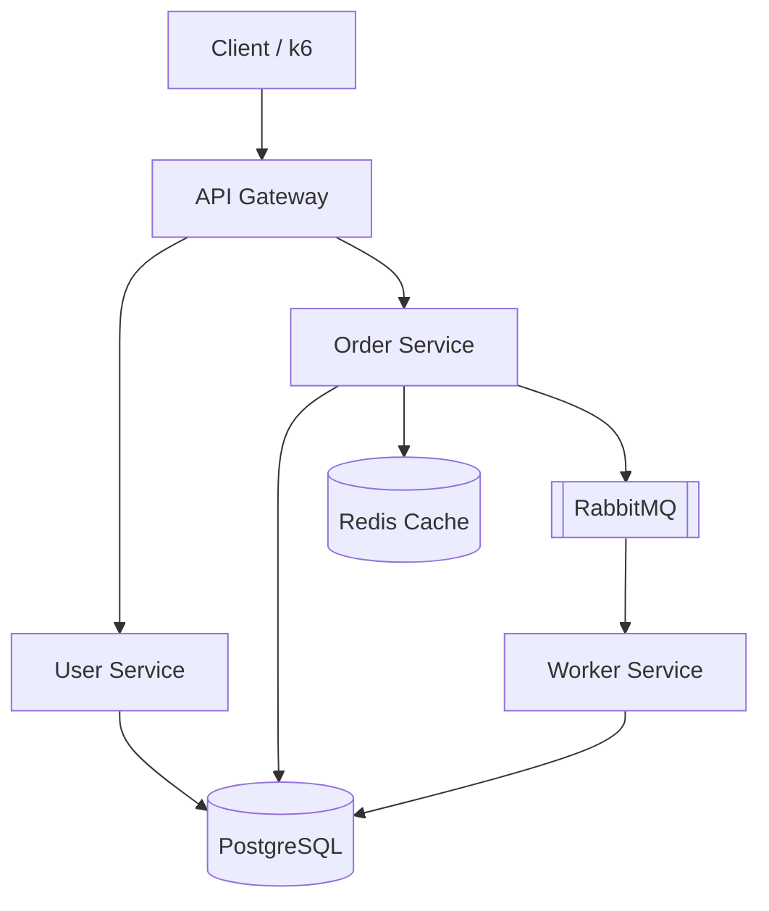

# PulseOps

### SRE Observability & Incident Response Platform

> A production-style SRE platform that detects service failures, correlates metrics,
> logs and traces, evaluates SLOs, triggers actionable alerts, and supports structured
> incident investigation and recovery.

This is a companion project to **KubeForge** (AWS/Terraform/EKS/GitOps/Argo CD). Where
KubeForge proves infrastructure-as-code and platform engineering, PulseOps proves the
**operations** half of SRE: can you tell a distributed system is unhealthy, prove it
with data, find the root cause, and recover it — with real, measured numbers, not
invented ones.

## Status

Build is incremental, phase by phase. See [docs/architecture.md](docs/architecture.md)
for the full design rationale.

| Phase | Area | Status |
|---|---|---|
| 1 | Architecture & SRE Design | ✅ done |
| 2 | Application Foundation | ✅ done |
| 3 | Docker Compose Environment | ✅ done |
| 4 | Metrics Instrumentation | ✅ done |
| 5 | Prometheus & Grafana | ⬜ not started |
| 6 | Structured Logging & Loki | ⬜ not started |
| 7 | OpenTelemetry & Tempo | ⬜ not started |
| 8 | Correlating Metrics/Logs/Traces | ⬜ not started |
| 9 | SLI/SLO Design | ⬜ not started |
| 10 | Error Budgets & Burn Rates | ⬜ not started |
| 11 | Prometheus Alert Rules | ⬜ not started |
| 12 | Alertmanager | ⬜ not started |
| 13 | Incident Response Framework | ⬜ not started |
| 14 | Failure Simulation | ⬜ not started |
| 15 | Load & Stress Testing | ⬜ not started |
| 16 | Incident Docs & Postmortems | ⬜ not started |
| 17 | Final Dashboards & Docs | ⬜ not started |

## Architecture (summary)



Full rationale, request-path tracing walkthrough, and technology decisions are in
[docs/architecture.md](docs/architecture.md).

## Repository Structure

```text
pulseops/
├── services/           gateway, user-service, order-service, worker
├── observability/       prometheus, grafana, loki, tempo, alertmanager, otel config
├── incidents/           reproducible failure scenarios + investigation writeups
├── load-tests/          k6 scripts
├── scripts/              failure-injection scripts (kill-service, break-redis, ...)
├── docs/                 architecture, SLOs, alerting, runbooks, postmortems
└── docker-compose.yml
```

## Quick Start

```bash
cp .env.example .env
docker compose up -d --build
```

This starts Postgres, Redis, RabbitMQ, and all four services. The gateway
listens on **http://localhost:7000** (not 8080 — see note below).

```bash
# create a user
curl -X POST http://localhost:7000/api/users \
  -H "Content-Type: application/json" \
  -d '{"name":"Nandu","email":"nandu@example.com"}'

# create an order for that user
curl -X POST http://localhost:7000/api/orders \
  -H "Content-Type: application/json" \
  -d '{"userId":1,"item":"widget","quantity":3}'

# check it - status should flip from "pending" to "completed"
# within a second or two once the worker consumes it off RabbitMQ
curl http://localhost:7000/api/orders/1
```

Other useful endpoints while it's running:
- RabbitMQ management UI: http://localhost:15672 (guest/guest) — watch the
  `order.created` queue depth live.
- Prometheus-format `/metrics` on every service: gateway `:7000`,
  user-service `:4001`, order-service `:4002`, worker `:4003`, plus
  RabbitMQ's own broker metrics on `:15692`. Nothing scrapes these yet —
  that's Phase 5. See [docs/observability.md](docs/observability.md) for
  what's measured and why (the RED method, and why each service also
  tracks its own dependencies beyond RED).
- `docker compose logs -f worker` — watch orders get consumed.
- `docker compose down -v` — stop everything and wipe the Postgres volume.

**Why port 7000 and not 8080:** on this dev machine, Hyper-V/WSL reserves
large chunks of the 7975-9191 range as dynamic port exclusions, so Docker
can't bind 8080, 8081, or 9090 to the host. The container itself still
listens on 8080 internally — only the host-side mapping changed
(`"7000:8080"` in `docker-compose.yml`). If your machine doesn't have this
issue, feel free to remap it back to 8080.

**A real reliability bug found and fixed during this phase:** RabbitMQ's
Docker healthcheck (`rabbitmq-diagnostics ping`) reports "healthy" before the
AMQP listener on port 5672 is actually ready to accept connections — a real
race observed while testing, not a hypothetical one. The worker's first
connection attempt on a fresh `docker compose up` hit `ECONNREFUSED`. Fixed
with bounded exponential backoff on startup (`services/worker/src/index.js`)
instead of crashing on the first failure — see the worker logs on a fresh
`docker compose up -d --build` for it retrying in real time.
