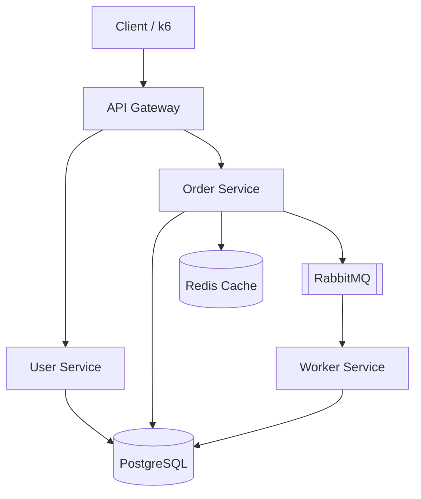

# PulseOps

### SRE Observability & Incident Response Platform

> A production-style SRE platform that detects service failures, correlates metrics,
> logs and traces, evaluates SLOs, triggers actionable alerts, and supports structured
> incident investigation and recovery.

This is a companion project to **KubeForge** (AWS/Terraform/EKS/GitOps/Argo CD). Where
KubeForge proves infrastructure-as-code and platform engineering, PulseOps proves the
**operations** half of SRE: can you tell a distributed system is unhealthy, prove it
with data, find the root cause, and recover it — with real, measured numbers, not
invented ones.

## Status

Build is incremental, phase by phase. See [docs/architecture.md](docs/architecture.md)
for the full design rationale.

| Phase | Area | Status |
|---|---|---|
| 1 | Architecture & SRE Design | ✅ done |
| 2 | Application Foundation | ✅ done |
| 3 | Docker Compose Environment | ✅ done |
| 4 | Metrics Instrumentation | ✅ done |
| 5 | Prometheus & Grafana | ✅ done |
| 6 | Structured Logging & Loki | ✅ done |
| 7 | OpenTelemetry & Tempo | ✅ done |
| 8 | Correlating Metrics/Logs/Traces | ✅ done |
| 9 | SLI/SLO Design | ✅ done |
| 10 | Error Budgets & Burn Rates | ✅ done |
| 11 | Prometheus Alert Rules | ✅ done |
| 12 | Alertmanager | ✅ done |
| 13 | Incident Response Framework | ✅ done |
| 14 | Failure Simulation | ✅ done |
| 15 | Load & Stress Testing | ⬜ not started |
| 16 | Incident Docs & Postmortems | ⬜ not started |
| 17 | Final Dashboards & Docs | ⬜ not started |

## Architecture (summary)



Full rationale, request-path tracing walkthrough, and technology decisions are in
[docs/architecture.md](docs/architecture.md).

## Service Level Objectives

Measured at the gateway, because that is the boundary a user experiences.

| SLO | Target | Measured baseline |
|---|---|---|
| Availability (non-5xx / total) | **99.5%** over 30d | 100% observed (zero 5xx) |
| Latency (requests under 250ms) | **99%** over 30d | 99.72% steady state |

Both targets are derived from measurements against this stack, not copied
from a reference architecture — including the reasoning for why availability
is set at 99.5% rather than the customary 99.9% (short observation window,
no redundancy anywhere). 4xx is deliberately excluded from the availability
failure set so a misbehaving client cannot burn the error budget.

Each SLO has an **error budget** (the allowed failure) and a **burn rate**
(how fast it is being spent, normalised so 1 = the budget lasts exactly one
30-day window). The **Executive Reliability Overview** dashboard shows SLO
status, budget remaining, and multi-window burn rates.

The budget rules were validated by deliberately stopping `user-service`
under load: the availability SLI fell to 0.9826, burn rate rose to 3.48
(`(1−0.9826)/0.005` — exact), and that one incident pushed the availability
budget to **−3.28%**, overspent.

See [docs/slos.md](docs/slos.md) for the full baseline data, the derivation
of every number, the error budget policy (what actually happens at 0%), and
the known threats to each target.

## Alerting

Fifteen alert rules exist; **five of them can wake a human**. The principle
is *page on symptoms, ticket on causes* — Redis can fail completely while
every request still succeeds through the cache-aside fallback, so a Redis
error is a warning, not a page.

Validated by stopping a service under live traffic and watching the
escalation: `ServiceDown` firing at +3 min, the fast-burn budget alert at
+12 min (25.14x), and zero alerts on a healthy system beforehand.

See [docs/alerting.md](docs/alerting.md) for the threshold derivations, the
measured detection times, and what is deliberately *not* alerted on.
Runbooks are in [docs/runbooks/](docs/runbooks/).

Alerts route through **Alertmanager** (http://localhost:9093): `page`-tier
alerts and `ticket`-tier alerts go to different receivers, a more severe
burn-rate alert inhibits its redundant lower-severity duplicates, and
silences suppress notification during planned maintenance. There are no
real Slack/PagerDuty credentials for this project, so delivery is proven
against a real local webhook receiver (`services/alert-receiver`,
inspectable at http://localhost:4004/alerts) instead of faked — verified
end-to-end by stopping a service under load and reading back the actual
deliveries, including a suppressed alert that provably never arrived.

## Incident Response

A firing alert is the start of a process, not the end of one. Severity
(SEV-1 through SEV-4) is decided during triage from actual observed
impact — deliberately kept distinct from *alert* severity (`critical`/
`warning`), which is a routing decision made in advance. The same
`ServiceDown` alert is SEV-1 for the gateway and SEV-3 for the worker,
because the worker has no user-visible impact at all (see
[docs/runbooks/service-down.md](docs/runbooks/service-down.md)).

MTTD and MTTR are defined precisely against real Prometheus/Alertmanager
timestamps — not estimated after the fact — so Phase 14's controlled
failures produce numbers rigorous enough to put on a resume.

See [docs/incident-response.md](docs/incident-response.md) for the full
lifecycle, severity decision guide, roles, and MTTD/MTTR definitions, and
[docs/postmortems/TEMPLATE.md](docs/postmortems/TEMPLATE.md) for the
blameless postmortem template Phase 16 will fill in with real incidents.

## Failure Simulation

All five incidents from the original plan were actually run against the
live stack — not scripted-and-assumed, run — with real timestamps, real
metrics, and two real bugs found and fixed mid-simulation:

| Incident | MTTD | Finding |
|---|---|---|
| [001 — Database Slowdown](incidents/incident-001-database-slowdown) | 4m32s (fast-burn) | Gateway p95 rose ~45x (20ms → 910ms) under Postgres CPU throttle |
| [002 — Redis Failure](incidents/incident-002-redis-failure) | 6m30s (post-fix) | **Redis going down hung requests indefinitely** instead of degrading gracefully — the documented cache-aside fallback had a real bug, fixed and re-verified live |
| [003 — Bad Deployment](incidents/incident-003-bad-deployment) | 4m31s | A one-character typo caused **silent success behind a client-visible 500** — proven by finding the "failed" order sitting in Postgres. Real `git revert` rollback in 16 seconds |
| [004 — Queue Backlog](incidents/incident-004-queue-backlog) | never (bug) → 16m10s (fixed) | **The alert designed to catch a dead worker couldn't fire while the worker was dead** — a PromQL absent-vs-zero bug, blind for 48 minutes during a real 34,591-message backlog |
| [005 — High Latency](incidents/incident-005-high-latency) | 4m36s | Clean, exactly-as-designed fault injection via a feature flag — the control case the other four are compared against |

Every number is a real measurement against Alertmanager's own delivery log,
not an estimate. See each incident's README for the full timeline,
PromQL/LogQL used, and lessons learned.

## Repository Structure

```text
pulseops/
├── services/           gateway, user-service, order-service, worker, alert-receiver
├── observability/       prometheus, grafana, loki, alloy, tempo, alertmanager config
├── incidents/           reproducible failure scenarios + investigation writeups
├── load-tests/          k6 scripts
├── scripts/              failure-injection scripts (kill-service, break-redis, ...)
├── docs/                 architecture, SLOs, alerting, runbooks, postmortems
└── docker-compose.yml
```

## Quick Start

```bash
cp .env.example .env
docker compose up -d --build
```

This starts Postgres, Redis, and all four services. RabbitMQ runs on
CloudAMQP (cloud), configured via `RABBITMQ_URL` in `.env` — see
`.env.example`. The gateway listens on **http://localhost:8080**.

```bash
# create a user
curl -X POST http://localhost:8080/api/users \
  -H "Content-Type: application/json" \
  -d '{"name":"Nandu","email":"nandu@example.com"}'

# create an order for that user
curl -X POST http://localhost:8080/api/orders \
  -H "Content-Type: application/json" \
  -d '{"userId":1,"item":"widget","quantity":3}'

# check it - status should flip from "pending" to "completed"
# within a second or two once the worker consumes it off the queue
curl http://localhost:8080/api/orders/1
```

Other useful endpoints while it's running:
- **Grafana: http://localhost:3000** (admin/admin, or browse anonymously) —
  three dashboards auto-provisioned: **Service Overview**, **Dependencies**
  and **Incident Investigation**. Open Incident Investigation, expand any
  line in the *Errors & Warnings* panel, and click its **TraceID → View
  trace** to jump straight into that request's distributed trace. From a
  span you can jump back to the same request's logs, or out to that
  service's RED metrics. See [docs/observability.md](docs/observability.md)
  for how the three pillars are wired together.
- Prometheus: http://localhost:9100 — raw metrics/query UI and scrape
  target health (`/targets`).
- Loki: http://localhost:3100 — query logs from Grafana's **Explore** tab
  (pick the Loki datasource). Every service logs structured JSON carrying a
  `requestId`, so one query follows a single request across all four
  services *and* across the RabbitMQ hop:
  ```logql
  {job="pulseops"} | requestId=`<paste-an-id>`
  ```
  Any response from the gateway returns its ID in the `x-request-id`
  header, so `curl -i` gives you something to paste.
- Tempo: http://localhost:3200 — distributed traces. Query them from
  Grafana's **Explore** tab with the Tempo datasource. Every log line
  emitted inside a request carries a `traceId`, so you can copy one
  straight out of a log into Explore and get the full span waterfall:
  one `POST /api/orders` is **49 spans across all four services**,
  including the hop across RabbitMQ into the worker.
- Grafana Alloy: http://localhost:12345 — the single telemetry agent's own
  UI. It ships container logs to Loki *and* receives OTLP traces from the
  services and forwards them to Tempo, so this is the first place to look
  if either logs or traces stop arriving.
- Prometheus-format `/metrics` on every service: gateway `:8080`,
  user-service `:4001`, order-service `:4002`, worker `:4003`. RabbitMQ's
  own broker metrics are no longer scraped since the move to CloudAMQP —
  see the "known gap" note in `observability/prometheus/prometheus.yml`
  and `docs/slos.md`.
- `docker compose logs -f worker` — watch orders get consumed.
- `docker compose down -v` — stop everything and wipe all volumes
  (Postgres data, Prometheus history, Grafana state).

**Why Prometheus is on 9100, not 9090:** Hyper-V/WSL on this dev machine
periodically reserves chunks of the ephemeral port range as dynamic
exclusions, and the exact ranges shift across reboots — this has already
hit 8080, 9090, and 9200 at different points in this project. When a port
bind fails with a Windows "access forbidden" error rather than "already in
use", that's this issue, not a real conflict: check
`netsh interface ipv4 show excludedportrange protocol=tcp` and remap the
host side only, e.g. `"9100:9090"` in `docker-compose.yml`. The container
always keeps listening on its standard port internally.

**A real reliability bug found and fixed during this phase:** RabbitMQ's
Docker healthcheck (`rabbitmq-diagnostics ping`) reports "healthy" before the
AMQP listener on port 5672 is actually ready to accept connections — a real
race observed while testing, not a hypothetical one. The worker's first
connection attempt on a fresh `docker compose up` hit `ECONNREFUSED`. Fixed
with bounded exponential backoff on startup (`services/worker/src/index.js`)
instead of crashing on the first failure — see the worker logs on a fresh
`docker compose up -d --build` for it retrying in real time.
