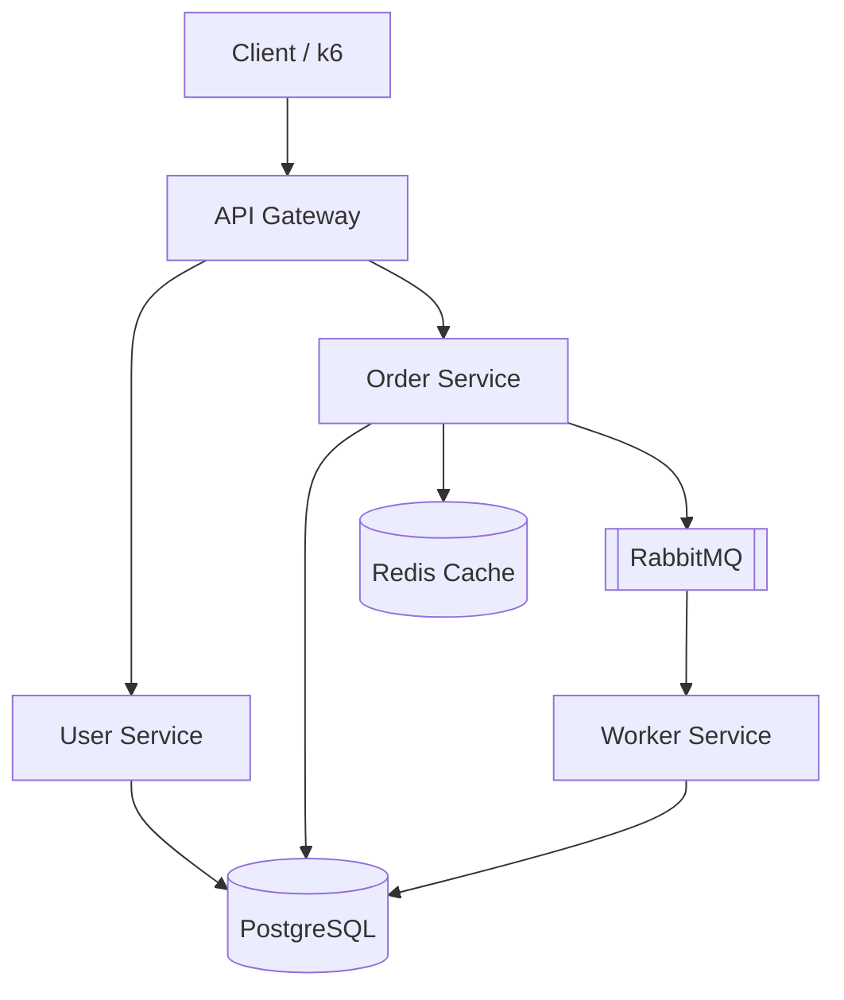

# PulseOps

### SRE Observability & Incident Response Platform

> A production-style SRE platform that detects service failures, correlates metrics,
> logs and traces, evaluates SLOs, triggers actionable alerts, and supports structured
> incident investigation and recovery.

This is a companion project to **KubeForge** (AWS/Terraform/EKS/GitOps/Argo CD). Where
KubeForge proves infrastructure-as-code and platform engineering, PulseOps proves the
**operations** half of SRE: can you tell a distributed system is unhealthy, prove it
with data, find the root cause, and recover it — with real, measured numbers, not
invented ones.

## Status

Build is incremental, phase by phase. See [docs/architecture.md](docs/architecture.md)
for the full design rationale.

| Phase | Area | Status |
|---|---|---|
| 1 | Architecture & SRE Design | ✅ done |
| 2 | Application Foundation | ⬜ not started |
| 3 | Docker Compose Environment | ⬜ not started |
| 4 | Metrics Instrumentation | ⬜ not started |
| 5 | Prometheus & Grafana | ⬜ not started |
| 6 | Structured Logging & Loki | ⬜ not started |
| 7 | OpenTelemetry & Tempo | ⬜ not started |
| 8 | Correlating Metrics/Logs/Traces | ⬜ not started |
| 9 | SLI/SLO Design | ⬜ not started |
| 10 | Error Budgets & Burn Rates | ⬜ not started |
| 11 | Prometheus Alert Rules | ⬜ not started |
| 12 | Alertmanager | ⬜ not started |
| 13 | Incident Response Framework | ⬜ not started |
| 14 | Failure Simulation | ⬜ not started |
| 15 | Load & Stress Testing | ⬜ not started |
| 16 | Incident Docs & Postmortems | ⬜ not started |
| 17 | Final Dashboards & Docs | ⬜ not started |

## Architecture (summary)



Full rationale, request-path tracing walkthrough, and technology decisions are in
[docs/architecture.md](docs/architecture.md).

## Repository Structure

```text
pulseops/
├── services/           gateway, user-service, order-service, worker
├── observability/       prometheus, grafana, loki, tempo, alertmanager, otel config
├── incidents/           reproducible failure scenarios + investigation writeups
├── load-tests/          k6 scripts
├── scripts/              failure-injection scripts (kill-service, break-redis, ...)
├── docs/                 architecture, SLOs, alerting, runbooks, postmortems
└── docker-compose.yml
```

## Quick Start

Not yet available — application and Compose environment land in Phases 2-3.
