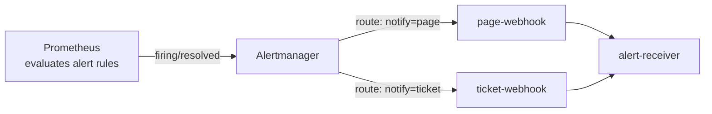

# Alerting (Phase 11)

## The organising principle: page on symptoms, ticket on causes

Fifteen alert rules exist. **Five of them can wake a human.**

That ratio is the entire design. A page means *users are being hurt right
now and a person must intervene*. Everything else is a warning: it explains
why something is wrong, and it belongs next to an incident rather than
starting one.

The clearest example in this system is Redis. The user-profile lookup is
cache-aside, so Redis can fail **completely** while every single request
still succeeds — just slower, with more load on Postgres. An alert that
pages on "Redis is erroring" would wake someone for a problem that has not
reached a single user. So `RedisErrors` is a warning, and if Redis failing
*does* start hurting users, a burn-rate alert pages and `RedisErrors` is
sitting right there as the explanation.

## What pages, and what does not

| Alert | Severity | Pages? | Fires on |
|---|---|---|---|
| `AvailabilityErrorBudgetFastBurn` | critical | **yes** | 14.4x burn over 1h **and** 5m |
| `AvailabilityErrorBudgetSlowBurn` | critical | **yes** | 6x burn over 6h **and** 30m |
| `LatencyErrorBudgetFastBurn` | critical | **yes** | 14.4x burn over 1h **and** 5m |
| `LatencyErrorBudgetSlowBurn` | critical | **yes** | 6x burn over 6h **and** 30m |
| `ServiceDown` | critical | **yes** | scrape failure for 2m |
| `AvailabilityErrorBudgetDrain` | warning | no | 3x burn over 1d **and** 2h |
| `LatencyErrorBudgetDrain` | warning | no | 3x burn over 1d **and** 2h |
| `NoTrafficReceived` | warning | no | no requests for 15m |
| `PostgresQueryFailures` | warning | no | query errors for 5m |
| `PostgresConnectionPoolSaturated` | warning | no | requests waiting on a connection |
| `RedisErrors` | warning | no | cache errors for 5m |
| `DownstreamCallFailures` | warning | no | service-to-service call errors |
| `QueuePublishFailures` | warning | no | cannot publish to RabbitMQ |
| `WorkerProcessingFailures` | warning | no | messages being nacked |
| `QueueBacklogGrowing` | warning | no | publish rate > consume rate for 15m |

## Alert fatigue, and how this design avoids it

Alert fatigue is not an annoyance, it is a reliability failure. Once an
on-call engineer has learned that most notifications are noise, the one that
mattered arrives in the same stream as the forty that did not — and gets the
same reflexive dismissal. A system with fifty noisy alerts is often *less*
observable than one with five trustworthy ones.

Four things keep the noise down here:

1. **Only symptoms page.** Causes become tickets. Five pageable alerts, not
   fifteen.
2. **Every alert requires duration.** Nothing fires on an instantaneous
   sample. `for:` ranges from 2m (service down) to 15m (queue backlog),
   scaled to how long the condition must persist before it is real.
3. **Burn-rate alerts require two windows to agree.** A long window
   ("has enough budget burned to matter?") and a short one ("is it *still*
   burning?"). Either alone is bad: the short window fires on every blip,
   the long one keeps firing for hours after recovery.
4. **No resource-threshold alerts at all.** There is deliberately no
   `CPU > 80%` rule — see below.

## Burn-rate thresholds are derived, not chosen

Burn rate is normalised so **1 means the budget lasts exactly one 30-day
window**. The thresholds follow from how much budget you are willing to lose
before someone looks:

| Threshold | Window | Budget spent | Tier |
|---|---|---|---|
| 14.4x | 1h | 2% of the month in an hour | page |
| 6x | 6h | 5% in six hours | page |
| 3x | 1d | 10% in a day | ticket |

14.4 is not folklore: `14.4 x (1h / 720h) = 2%`. That is where the number
comes from.

## Measured behaviour, not assumed

Validated by stopping `user-service` under live traffic and watching the
alerts escalate:

| Elapsed | State |
|---|---|
| +1 min | `ServiceDown` pending |
| +3 min | `ServiceDown` **firing**, `DownstreamCallFailures` pending |
| +4 min | `AvailabilityErrorBudgetDrain` pending |
| +5 min | `AvailabilityErrorBudgetSlowBurn` pending |
| +8 min | `AvailabilityErrorBudgetFastBurn` pending |
| +12 min | `AvailabilityErrorBudgetFastBurn` **firing** at 25.14x |

On a healthy system beforehand: **zero alerts firing or pending**, which is
the property that matters most.

### Why the "fast" burn alert took 12 minutes

This looks wrong and is not. The fast-burn alert needs
`burn_rate1h > 14.4`, and a 1-hour window has to *accumulate* enough bad
events to get there. Crossing 14.4x requires 7.2% of the hour's requests to
have failed (`14.4 x 0.005`). At the observed ~35% error rate that takes
roughly 20% of an hour — about 12 minutes. The observation matches the
arithmetic exactly.

That is a real property of burn-rate alerting worth understanding before
relying on it: **it is deliberately slow to page, because it is measuring
budget damage rather than instantaneous badness.** `ServiceDown` fires in
2 minutes and exists precisely to cover that gap for hard failures.

### Alerts clear correctly too

`ServiceDown` cleared immediately once the container came back. The
burn-rate alerts kept firing afterwards — **correctly**, because the 6h and
30m windows still contained the outage. The budget really was spent; the
alert is telling the truth until the incident ages out of the window.

## What is deliberately NOT alerted on

**No CPU or memory threshold alerts.** Resource usage correlates poorly with
user impact in both directions: a service can run hot and serve every
request perfectly, or sit at 10% CPU while everything times out on a
downstream lock. CPU and memory are on the dashboards for *diagnosis*; they
do not page. This is the same reasoning the project spec calls out about not
relying on `CPU > 80%`.

**No raw p95 latency alert.** It would be redundant with
`LatencyErrorBudgetFastBurn` and strictly worse: a fixed p95 threshold has
no notion of how much budget remains, so it fires identically whether the
month has been flawless or is already blown. Two alerts covering the same
failure with different logic is how contradictory pages happen.

**No `absent()` alerts on individual metrics.** `ServiceDown` already covers
the scrape failing, and metric-absence rules are a classic source of
false pages during deploys.

## Two bugs found while building this

**1. `humanize` made rates unreadable.** Sub-1 rates rendered with an SI
*milli* prefix: a rate of 0.1276/s displayed as **"127.6m/s"**, which at a
glance reads as 127 per second — a two-order-of-magnitude misread in exactly
the situation where misreading is expensive. Rate annotations now use
`printf "%.3f"`, so the same value renders as `0.106/s`.

**2. A quoting mistake took the entire alerting system down.** Changing
those annotations introduced `{{ $value | printf "%.3f" }}` inside a
double-quoted YAML string, where the inner quotes terminate the scalar early.
Prometheus refused the config and **crash-looped** — meaning that for several
minutes there was no metric collection and no alerting at all, with nothing
to alert about the fact that alerting was gone.

The lesson is procedural, and it is now the habit: **validate before
reloading.**

```bash
docker run --rm -v "$(pwd)/observability/prometheus:/rules:ro" \
  --entrypoint promtool prom/prometheus:v2.55.1 \
  check rules /rules/rules/*.yml
```

It also makes a point worth keeping: the monitoring stack is itself a single
point of failure, and it is the one component that cannot report its own
outage.

---

# Alertmanager (Phase 12)

Prometheus decides **what** is wrong. Alertmanager decides **who** hears
about it, **how urgently**, **how often**, and — just as importantly —
**when NOT to tell them something they already know.**



## Why there is no real Slack/PagerDuty integration here

This project has no Slack workspace or PagerDuty account to wire in, and
faking one — printing "sent to Slack" without sending anything — would
violate the rule this entire project runs on: **never invent a result.**

Instead, `services/alert-receiver/` is a small, real Express service that
Alertmanager genuinely delivers webhooks to over HTTP. Every claim below
("routing works", "inhibition suppressed X") is backed by an actual
delivery to that service, inspectable at `http://localhost:4004/alerts`,
not by reading a config file and assuming it behaves as written.

The real Slack and email `receivers:` config — the actual shape you'd use
with a real webhook URL or SMTP relay — is documented (not faked) at the
bottom of `observability/alertmanager/alertmanager.yml`. Swapping to a real
receiver is a config change there, not an architecture change anywhere
else.

## Routing: `notify` label decides the channel

The root route groups by `['alertname', 'slo']` and falls through to two
child routes matching the `notify` label already set on every alert in
Phase 11:

| `notify` | Receiver | `group_wait` | `repeat_interval` |
|---|---|---|---|
| `page` | `page-webhook` | 10s (reach someone fast) | 15m (keep reminding) |
| `ticket` | `ticket-webhook` | 1m | 12h (no need to nag) |

## Verified end-to-end, not assumed

`user-service` was stopped under live traffic — the same technique used in
Phases 10-11 — and the actual webhook deliveries were read back:

```text
[11:01:05] firing    page-webhook     ServiceDown
[11:05:11] firing    page-webhook     AvailabilityErrorBudgetFastBurn
[11:06:25] firing    ticket-webhook   DownstreamCallFailures
[11:06:41] firing    page-webhook     LatencyErrorBudgetFastBurn
[11:09:05] resolved  page-webhook     ServiceDown
```

Four things are proven by that log, not by reading the config:

1. **Routing** — `ServiceDown` and both `FastBurn` alerts (severity
   critical, `notify: page`) went to `page-webhook`; `DownstreamCallFailures`
   (`notify: ticket`) went to `ticket-webhook`.
2. **Delivery** — these are real HTTP POSTs the receiver logged on arrival,
   not alerts merely existing inside Prometheus.
3. **Resolution notifications** — `send_resolved: true` means recovery is
   announced too, not just breakage. The `resolved` line for `ServiceDown`
   arrived once the container came back and Prometheus re-scraped it.
4. **Inhibition working from the *absence* of a delivery** — see below.

## Inhibition: proving a negative

`AvailabilityErrorBudgetFastBurn` and `AvailabilityErrorBudgetSlowBurn` both
fired in Prometheus during the same incident — the same underlying budget
burn crossing two different thresholds. Checking Alertmanager's own view:

```text
AvailabilityErrorBudgetFastBurn   state=active      inhibitedBy=
AvailabilityErrorBudgetSlowBurn   state=suppressed  inhibitedBy=6429631006a1f090
LatencyErrorBudgetFastBurn        state=active      inhibitedBy=
LatencyErrorBudgetSlowBurn        state=suppressed  inhibitedBy=8f21781c78dd5294
```

And confirmed the suppressed alerts **never reached the webhook receiver at
all** — not delivered-then-ignored, never sent:

```text
did SlowBurn ever get delivered to the webhook? (should be NO)
  never delivered — inhibition worked
```

That is the actual value of inhibition: one incident produced one page
(`FastBurn`) instead of three redundant ones describing the same budget
being spent. `equal: ['slo']` scopes each inhibit rule so an availability
incident cannot suppress a latency alert, or vice versa.

## Silencing: verified via the API, not just documented

```bash
curl -X POST http://localhost:9093/api/v2/silences -d '{...matchers, comment...}'
```

immediately turned `ServiceDown` from `active` to:

```text
state=suppressed  silencedBy=ecaf3923-1d3f-4afe-9423-2471158362d0
```

This is the mechanism for planned maintenance: silence the alert *before*
taking the affected service down deliberately, so a known, intentional
change doesn't page anyone. Deleting the silence
(`DELETE /api/v2/silence/{id}`) restores normal alerting immediately — it
does not wait for the next evaluation cycle.

## Accessing it yourself

- Alertmanager UI: **http://localhost:9093** — active alerts, silences,
  and which receiver each alert routed to.
- alert-receiver deliveries: **http://localhost:4004/alerts** — the ground
  truth for "did this actually get sent, and to which channel".

## Interview Questions This Phase Should Prepare You For

1. **"What should page?"** — Symptoms with user impact. Causes become
   tickets. Five of fifteen rules here page; the rest exist to explain an
   incident, not to start one.
2. **"Why not alert on CPU?"** — It does not reliably correlate with user
   impact in either direction. Resource metrics are for diagnosis.
3. **"Why do burn-rate alerts use two windows?"** — The long window asks
   whether enough budget burned to matter; the short one asks whether it is
   still happening. Either alone is either noisy or slow to clear.
4. **"Where does 14.4 come from?"** — `14.4 x (1h/720h) = 2%` of a 30-day
   budget in one hour. It is derived from how much budget loss justifies
   waking someone.
5. **"Your fast-burn alert took 12 minutes. Isn't that broken?"** — No. The
   1h window must accumulate enough failures to cross the threshold; at a
   35% error rate that is ~12 minutes, which matches the arithmetic. Fast
   hard failures are covered by `ServiceDown` at 2 minutes instead.
6. **"How do you keep on-call from ignoring alerts?"** — Make almost nothing
   page, require duration on everything, require two windows to agree for
   budget alerts, and attach a runbook and the current value to every alert
   so responding is cheap.
7. **"An alert fired and the problem is already fixed — why is it still
   firing?"** — Long-window burn alerts keep firing until the incident ages
   out of the window, because the budget really was spent. That is intended;
   the short-window half is what stops it firing indefinitely.
8. **"What's the difference between what Prometheus does and what
   Alertmanager does?"** — Prometheus evaluates rules and decides *whether*
   something is wrong. Alertmanager receives that firing/resolved signal and
   decides *who* hears about it, through which channel, grouped with what
   else, how often it repeats, and whether a more urgent alert or an active
   silence means it should not be sent at all.
9. **"Two alerts fire for the same incident. How do you avoid two pages?"**
   — Inhibition. A more severe alert (fast burn) suppresses a less severe
   one describing the same problem (slow burn, same SLO) — verified here by
   confirming the suppressed alert never reached the receiver, not just that
   Alertmanager's UI labeled it suppressed.
10. **"How do you avoid paging someone during planned maintenance?"** — A
    silence, created before the maintenance window, matching the alert that
    the planned change will trigger. It suppresses notification without
    touching the underlying alert rule, and can be removed instantly if the
    maintenance runs long or something unrelated breaks.
11. **"You don't have real Slack/PagerDuty credentials for this demo. What
    do you do?"** — Build a real HTTP receiver and verify actual delivery to
    it, and document the real Slack/email config shape as inert reference
    rather than logging a fabricated "sent" message. The distinction between
    "verified" and "would work with credentials" stays explicit instead of
    getting blurred.
