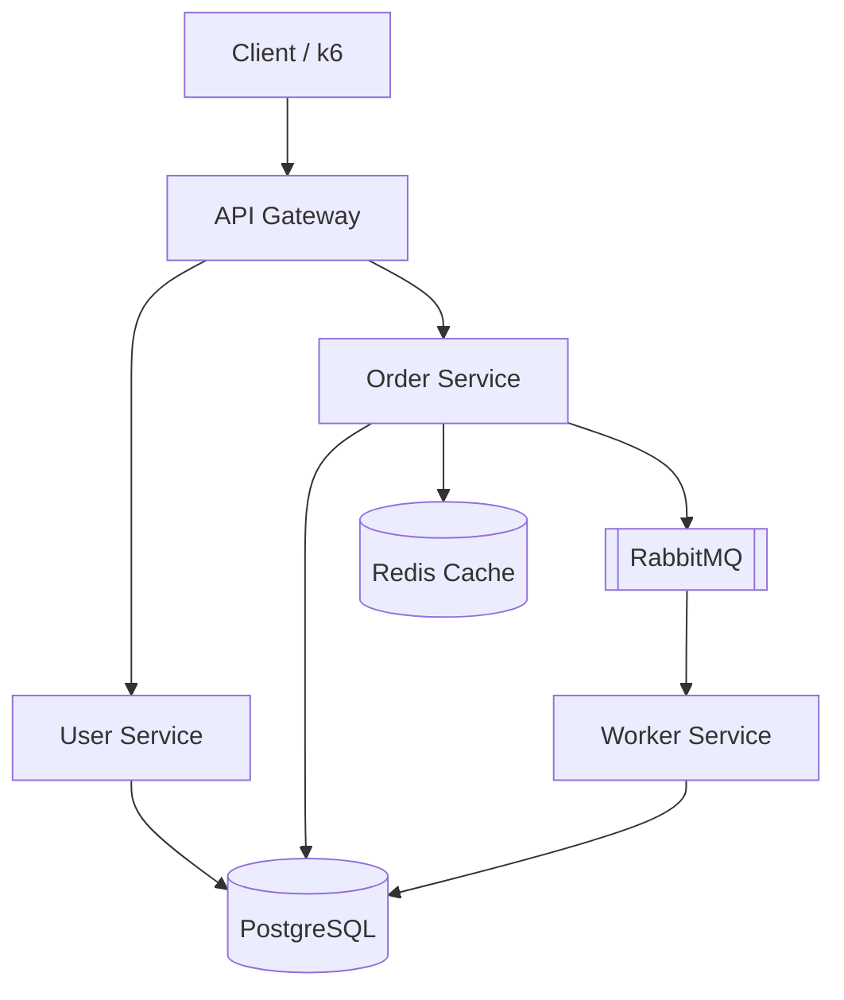
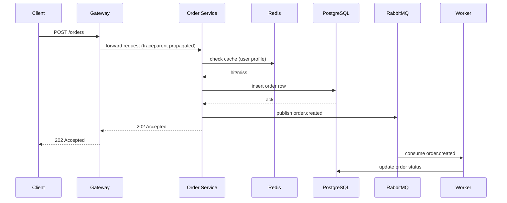
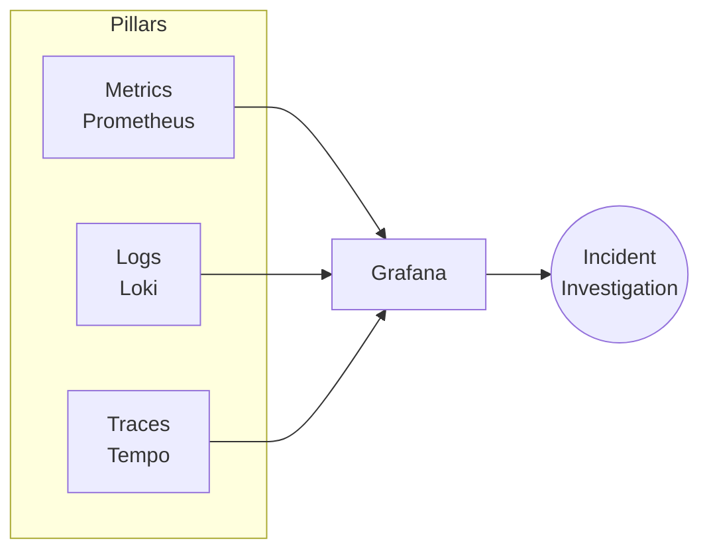

# PulseOps — Architecture & SRE Design (Phase 1)

## 1. Problem Statement

PulseOps is not a business app — it's a **subject to operate**. The application exists
only so we have something realistic to instrument, monitor, alert on, break, and recover.
The deliverable that matters is the *operational layer* wrapped around it: metrics, logs,
traces, SLOs, alerts, and a documented incident-response practice.

This is a deliberate contrast with KubeForge, which proved infrastructure skills
(Terraform, EKS, GitOps, autoscaling). PulseOps proves a different skill set:
*given a running distributed system, can you tell when it's unhealthy, prove it with
data, find the root cause, and fix it under time pressure?*

## 2. Why This Service Topology

Four services, three dependency types (SQL store, cache, message broker). That's the
minimum topology that produces **every failure mode we need for the incident library**:

| Service | Purpose | Why it exists |
|---|---|---|
| **Gateway** | Single entry point, request routing | Root span for every trace; natural place for rate-limiting/circuit-breaker patterns; where "the user's experience" is measured (RED metrics here = what users feel) |
| **User Service** | Simple CRUD over Postgres | Gives us a *second* independent service so traces are genuinely distributed, and a service we can crash/rollback independently for the bad-deployment incident |
| **Order Service** | Reads/writes Postgres, reads/writes Redis, publishes to RabbitMQ | The most "instrumentable" service — touches all three dependency types, so most incidents (DB slowdown, Redis failure, queue backlog) center here |
| **Worker** | Consumes RabbitMQ, writes Postgres | Demonstrates async processing health — queue depth, consumer lag, processing rate — which HTTP-only systems never need to show |

We are explicitly **not** building: payments, real business logic, a frontend, or
auth beyond a stub. Any hour spent on business features is an hour not spent on
observability, and that's the wrong trade for this project.

## 3. Request Path (why tracing is meaningful here)

A single `POST /orders` call should fan out like this:

This single flow alone justifies distributed tracing: latency or errors can originate
in five different places, and only a trace ID threading through all of them tells you
which one. This is also why we propagate `traceparent` headers and stamp `requestId`
on every log line — see [observability.md](observability.md) (Phase 6-8) for the
correlation-ID-vs-trace-ID distinction.

## 4. Technology Choices & Rationale

| Layer | Choice | Why (not "what's popular") |
|---|---|---|
| App runtime | Node.js + Express | Fast to instrument, huge OpenTelemetry auto-instrumentation support, keeps focus off framework plumbing |
| Primary datastore | PostgreSQL | Realistic slow-query and connection-pool-exhaustion failure modes; `pg_stat_activity` gives real metrics to scrape |
| Cache | Redis | Cheapest way to demonstrate cache-hit-ratio degradation and its knock-on effect on DB load (Incident 2) |
| Broker | RabbitMQ | Queue depth / consumer lag is a distinct failure signature that HTTP metrics can't show (Incident 4) |
| Metrics | Prometheus | Industry-standard pull model, PromQL is the alerting/SLO lingua franca |
| Dashboards | Grafana | Single pane across metrics+logs+traces |
| Logs | JSON logs → Loki | Cheap, label-based log storage that plugs directly into Grafana next to metrics |
| Traces | OpenTelemetry SDK → Tempo | Vendor-neutral instrumentation; Tempo needs no separate indexing infra, keeps local footprint small |
| Alerting | Prometheus rules + Alertmanager | Decouples "when is something wrong" (rules, PromQL) from "who gets told and how" (routing, grouping, silencing) — a real SRE separation of concerns |
| Load testing | k6 | Scriptable, produces the RPS/latency/error-rate numbers this project promises never to fabricate |
| Local infra | Docker Compose | Kubernetes here would just be re-proving KubeForge; Compose keeps the loop fast and keeps the spotlight on observability |

## 5. The Three Pillars, Applied

Each pillar answers a different question, and the investigation workflow depends on
moving between them, not picking one:

- **Metrics** tell you *something* is wrong and roughly *how much* (aggregate, cheap, always-on).
- **Logs** tell you the *specific event and error detail* (expensive, high cardinality, point-in-time).
- **Traces** tell you *where in the call graph* the problem physically occurred (causal, cross-service).

The RED method (Rate, Errors, Duration) is our metrics baseline because it's
**symptom-based, not resource-based** — it measures what the user experiences
(is the service being used, is it failing, is it slow) rather than what the box is
doing (CPU/memory). Section 12/13 will build burn-rate alerts on top of RED signals
specifically because resource alerts (`CPU > 80%`) don't reliably correlate with
user-facing pain, and alerting on the wrong signal is the single biggest driver of
alert fatigue.

## 6. What Phase 1 Deliberately Defers

- SLI/SLO numbers — Phase 9, after we have real traffic to measure against.
- Alert thresholds — Phase 11, derived from error budgets, not guessed.
- Actual service code — Phase 2.
- Kubernetes — out of scope entirely unless a specific later phase benefits from it.

## Interview Questions This Phase Should Prepare You For

1. "Why would you choose a message queue between two services instead of a direct call?" — decoupling producer/consumer throughput, backpressure, and failure isolation (Order Service can accept orders even if Worker is briefly down).
2. "What's the difference between a correlation ID and a trace ID?" — covered fully in `observability.md`, but the short version: correlation ID is app-defined and can span multiple traces/retries; trace ID is protocol-level (W3C Trace Context) and scoped to one distributed call tree.
3. "Why RED and not USE (Utilization, Saturation, Errors)?" — RED measures service-level/user-facing behavior; USE measures resource-level behavior. You want RED for "is the service healthy" and USE for "why is a specific resource the bottleneck" — we'll use both, but RED drives alerting, USE drives root-cause.
4. "Why not just use one Postgres instance for both services?" — realistic failure isolation: a slow query in Order Service's table shouldn't be indistinguishable from a User Service problem when you're staring at a shared connection pool metric.
