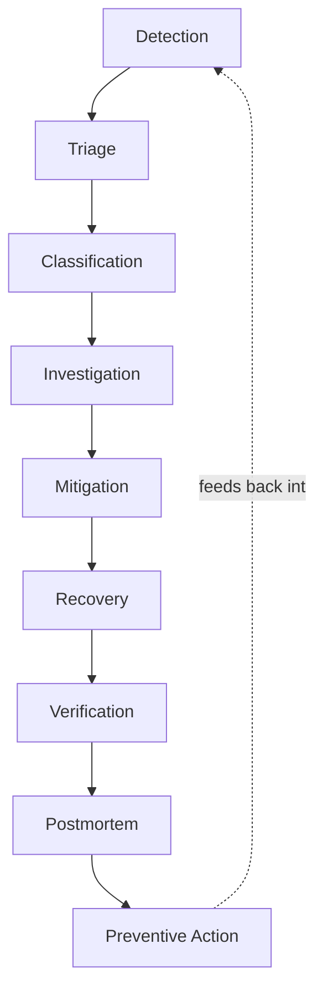

# Incident Response Framework (Phase 13)

Phases 9-12 built the machinery that notices something is wrong and tells
someone. This phase defines what happens **after** the page arrives: how
severity gets decided, what the response actually looks like stage by
stage, and exactly how MTTD and MTTR will be measured once Phase 14 runs
real failures against this system.

Nothing here is generic incident-response boilerplate copied from a
textbook. Every severity threshold and every impact assessment below
references artifacts that already exist in this repo — the alert rules,
the runbooks, the SLO error budget — because a framework that isn't wired
to the actual system is theatre.

## Alert severity is not incident severity

This distinction matters enough to state before anything else. Look at
`observability/prometheus/rules/alerts.yml` and you'll find exactly two
values in the `severity` label:

| Alert `severity` label | `notify` | What it decides |
|---|---|---|
| `critical` | `page` | Wakes someone up |
| `warning` | `ticket` | Waits for working hours |

That's a **routing** decision, made in advance, from the alert definition
alone. It answers "should this interrupt someone's sleep."

**Incident severity (SEV-1 through SEV-4) is a different question**,
answered *during triage*, from the actual observed impact: how many users,
which capability, for how long. A `ServiceDown` page for the `gateway`
and a `ServiceDown` page for the `worker` carry the identical alert
severity (`critical`) and the identical `notify: page` routing — but per
[docs/runbooks/service-down.md](runbooks/service-down.md), one is a
total outage and the other has **no user-visible impact at all**. Treating
every page as the same incident severity would either under-react to the
gateway case or cry wolf on the worker case. Triage is the step that tells
them apart, and it happens after the page, not instead of it.

## Severity levels

| Severity | Definition | Response |
|---|---|---|
| **SEV-1** | Critical system outage. The primary user journey (create/read a user or order) is broken for all or nearly all users. | Immediate, full incident process. All hands if needed. |
| **SEV-2** | Major user impact. A significant subset of users or one full capability is broken, but the system is not entirely down. | Immediate response, full process, may not need more than one responder. |
| **SEV-3** | Partial degradation. Users are affected in a limited or intermittent way — slower, occasional errors, a non-critical feature down. | Investigate promptly; postmortem only if it recurs or the cause is non-obvious. |
| **SEV-4** | Minor issue. No user-visible impact, or a cause-level warning that hasn't (yet) reached a user. | Ticket, handled during working hours. No incident declared. |

### Decision guide, grounded in what actually breaks in this system

This is not abstract — it's the same impact analysis already written into
the runbooks, promoted here into a single reference table:

| Scenario | Severity | Why (see the runbook for detail) |
|---|---|---|
| `gateway` down | SEV-1 | Single entry point, no redundancy — everything breaks |
| `order-service` down | SEV-1 | All order reads and writes fail |
| Availability fast burn (`>14.4x`, page) | SEV-1 | 2% of the monthly budget in an hour means real, ongoing user-facing failure |
| `user-service` down | SEV-2 | User reads fail; order creation only fails on a cache **miss**, so impact ramps up rather than hitting instantly |
| Availability slow/drain burn (page or ticket) | SEV-2 or SEV-3 | Real but slower-moving budget spend — see [slo-burn-rate.md](runbooks/slo-burn-rate.md)'s escalation note (burn rate > ~50x escalates to SEV-1) |
| Latency fast burn (page) | SEV-2 | Requests are slow, not failing — degraded, not down |
| `worker` down | SEV-3 | No user-visible failure; orders silently stay `pending` forever — a correctness problem, not an outage (see the "worker row" warning in service-down.md) |
| Any single dependency warning (Postgres/Redis/RabbitMQ/downstream) firing **alone** | SEV-4 | Per dependency-degraded.md: "if one of these fires alone, you have advance warning, not an incident" |
| Dependency warning firing **alongside** a page | inherits the page's severity | The warning is the explanation, not a separate incident |

If a scenario doesn't match this table cleanly, that's expected — the table
covers what's known to break today. Use the definition, not just the
lookup: how many users, how much of the journey, for how long.

## The lifecycle



Each stage maps to a real artifact or tool already built in this project —
this is not an aspirational process, it's how to actually use what exists:

| Stage | What happens | Tooling in this project |
|---|---|---|
| **Detection** | An alert fires, or a person notices something | Alertmanager (Phase 12); `ServiceDown` catches the case with no traffic to alert on otherwise |
| **Triage** | Acknowledge, assess rough scope | [Incident Investigation dashboard](http://localhost:3000/d/pulseops-incident-investigation) — service up/down first, per its own panel ordering |
| **Classification** | Assign SEV-1 through SEV-4 | The table above |
| **Investigation** | Find the root cause | Metrics → logs → traces, in that order — click a log line's TraceID to jump straight to the trace (Phase 8); the matching [runbook](runbooks/README.md) for the firing alert |
| **Mitigation** | Stop the bleeding — not necessarily fix the cause | Runbook's mitigation section; usually rollback, restart, or shed load |
| **Recovery** | Confirm the mitigation actually worked | Watch the burn rate return toward 0 and the SLI recover (see MTTR definition below — recovery is defined by data, not by feeling) |
| **Verification** | Confirm the fix is durable, not a fluke | Watch through at least one more evaluation window before standing down |
| **Postmortem** | Blameless writeup with real measured numbers | [docs/postmortems/TEMPLATE.md](postmortems/TEMPLATE.md) |
| **Preventive Action** | Turn the postmortem's findings into actual backlog items | Tracked action items; if the SLO budget went negative, the [error budget policy](slos.md#what-happens-when-the-budget-is-exhausted) applies until it recovers |

## Declaring an incident

An incident is declared — meaning the process below actually starts,
timestamps get recorded, and (eventually) a postmortem gets written — when
**any** of:

- A `critical`/page alert is firing.
- A `warning`/ticket alert is assessed at triage as SEV-3 or worse (e.g. it
  turns out users *are* affected despite the ticket-tier routing).
- A human notices user-facing impact before any alert has fired — this is
  itself a finding for the postmortem: something should have alerted and
  didn't.

A lone `warning` alert with no observed user impact is **not** an incident
— it's a ticket, exactly as designed in Phase 11.

## Roles

This is a one-person project, so one person fills every role below. They
are still named and separated deliberately, because conflating them is a
real failure mode in actual incidents — the person driving the technical
fix should not also be the one deciding whether to page in more help or
managing stakeholder updates, because both jobs compete for the same
attention at the worst possible time.

| Role | Responsibility | In this project |
|---|---|---|
| **Incident Commander (IC)** | Owns the process: severity call, when to escalate, when to stand down | Solo — but the *decision points* (severity, escalation, stand-down) are still made explicitly and recorded in the timeline, not skipped |
| **Responder / Investigator** | Does the actual diagnosis and mitigation | Solo, using the dashboards/runbooks above |
| **Communicator** | Posts status updates (see below) | Solo — updates are still written, even with no audience but the postmortem itself, so the discipline transfers to a team context |
| **Scribe** | Records the timeline as it happens | Solo — real timestamps pulled from Prometheus/Alertmanager after the fact (see MTTD/MTTR below), not reconstructed from memory |

## Communication during an incident

Even solo, a status update forces the discipline of stating current
understanding plainly — which is exactly the skill that matters on a real
team, and the habit is worth building here rather than skipping because
"no one's watching."

```text
[SEV-X] <one-line summary>
Status: investigating / mitigating / monitoring / resolved
Impact: <who/what is affected, in user terms>
Started: <time>
Current action: <what's being done right now>
Next update: <time>
```

Cadence: every 15-30 minutes for SEV-1/2 while active, at natural
milestones for SEV-3.

## MTTD and MTTR: exact definitions

Phase 14 will run real, controlled failures and needs unambiguous
timestamps to measure against — "roughly when it started" is not
sufficient for numbers going on a resume. Controlled incidents give an
advantage most real postmortems don't have: **the injection time is known
exactly**, because the person running the incident is also the one
triggering it.

**MTTD (Mean Time To Detect)**

```text
MTTD = time(alert reaches `firing` in Alertmanager)
     − time(the failure was actually injected)
```

For a controlled incident, "injected" is the timestamp the failure command
was run (documented per-incident, e.g. `docker compose stop
user-service`). For an uncontrolled/real incident, it would be the
timestamp of the first bad event in the data (first 5xx in the logs, first
breach in the metrics) — necessarily a judgment call, which is exactly why
the controlled incidents in Phase 14 are more rigorous than a typical
postmortem, not less.

The alert-receiver's delivery log (`http://localhost:4004/alerts`,
Phase 12) gives the exact moment a notification was actually sent, which is
a stricter and more honest number than "when Prometheus's internal state
changed" — it's the moment a human *could* have known, not just the moment
the condition became mathematically true.

**MTTR (Mean Time To Recover)**

```text
MTTR = time(SLI returns to normal AND the alert resolves)
     − time(alert reached `firing`)
```

Recovery is defined by data, deliberately not by "the mitigation command
finished running" — a restart can complete instantly while the SLI is
still recovering (see the AMQP warm-up behavior from Phase 7: the fix
landed, but the *effect* takes a moment to show in the metrics). The
correct recovery timestamp is when Alertmanager actually marks the alert
`resolved`, cross-checked against the SLI/burn-rate panels on the
Executive Reliability dashboard actually returning toward baseline —
not the first moment they dip in the right direction.

Both numbers get pulled from Prometheus's `/api/v1/query_range` and
Alertmanager's `/api/v2/alerts` history after the fact, the same way every
other measured number in this project was obtained — not estimated, not
rounded to something that sounds better.

## Blameless postmortems

"Blameless" doesn't mean "no cause is identified" — it means the causal
chain stops at systems and decisions, not at a person. "The connection was
established lazily instead of at startup" is a blameless finding; "someone
should have caught that" is not, even when both point at the same commit.
The [AMQP cold-start bug found during Phase 7](observability.md) is the
template for this: the writeup names the specific code path and the fix,
never a person.

Template: [docs/postmortems/TEMPLATE.md](postmortems/TEMPLATE.md). Every
number in a completed postmortem must come from Prometheus, Loki, Tempo, or
Alertmanager — never invented, never rounded to sound better. If a number
isn't known, the postmortem says so rather than guessing.

## Preventive action and the error budget

A postmortem that doesn't change anything is a wasted incident. Action
items get tracked, and severity of follow-through is tied to the error
budget policy already defined in
[docs/slos.md](slos.md#what-happens-when-the-budget-is-exhausted): if an
incident pushes the budget negative, reliability work — specifically the
action items from that incident's postmortem — takes priority over feature
work until the budget recovers. This is what stops "lessons learned"
sections from being purely decorative.

## Interview Questions This Phase Should Prepare You For

1. **"What's the difference between alert severity and incident
   severity?"** — Alert severity (critical/warning here) is decided in
   advance and controls routing — does this page or wait. Incident severity
   (SEV-1..4) is decided during triage from actual observed impact. The
   same alert can produce different incident severities depending on which
   service or scope it's about.
2. **"How do you decide when something is actually an incident?"** — A
   page is always at least investigated; a ticket-tier warning is not an
   incident unless triage finds real user impact behind it. Declaring
   every warning an incident trains people to stop taking the word
   seriously.
3. **"How would you measure MTTD for an incident you didn't inject
   yourself?"** — Define incident start as the first bad event in the
   data (first failed request, first threshold breach), not by memory or
   feeling. It's a judgment call, and a rigorous postmortem says so rather
   than presenting it as precise.
4. **"Why not declare recovery the moment you apply the fix?"** — The fix
   landing and the system actually recovering can be different moments —
   a cache needs to warm, a connection needs to re-establish, a queue
   needs to drain. Recovery should be confirmed by the metric/alert
   actually returning to normal, not by the mitigation command exiting
   with status 0.
5. **"What makes a postmortem 'blameless' without being toothless?"** — It
   still names an exact cause and an exact fix; it just stops the chain at
   a system or a decision rather than a person. "The connection was opened
   lazily" is blameless and specific at the same time.
6. **"Why define roles for a process one person runs?"** — Because
   conflating "fix it" and "manage the incident" is a real failure mode
   even solo — deciding whether to escalate competes for the same
   attention as debugging. Separating the roles on paper keeps both jobs
   from being done badly at once.
