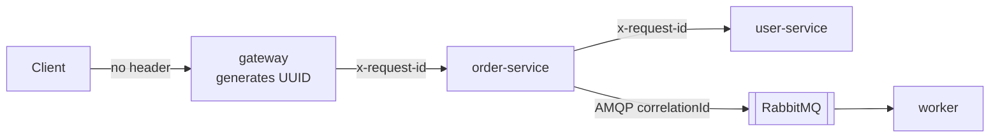
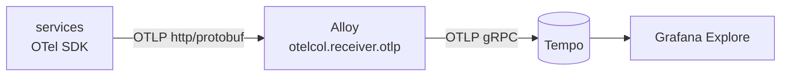
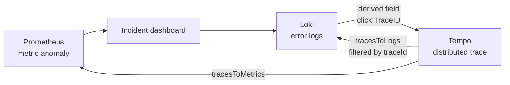

# Observability — Metrics, Logs & Traces (Phases 4-8)

Phase 4 instruments every service with Prometheus-format metrics via
`prom-client`, exposed on `/metrics`. Phase 5 stands up Prometheus to scrape
them and Grafana to visualize them. Phase 6 adds the second pillar:
structured JSON logs, correlated by request ID and queryable in Loki.
Phase 7 adds the third: distributed traces via OpenTelemetry, stored in
Tempo. Phase 8 wires them to each other, so an investigation is a sequence
of clicks rather than copy-pasting IDs between browser tabs.

## Why RED, and why it's not the whole picture

**RED = Rate, Errors, Duration.** Applied per HTTP endpoint:

- **Rate** — `http_requests_total` (a Counter). `rate(http_requests_total[5m])`
  in PromQL gives requests/sec.
- **Errors** — the `status_code` label on that same counter.
  `rate(http_requests_total{status_code=~"5.."}[5m])` gives the error rate
  without a second metric.
- **Duration** — `http_request_duration_seconds` (a Histogram).
  `histogram_quantile(0.95, rate(http_request_duration_seconds_bucket[5m]))`
  gives p95 latency.

RED is symptom-based: it measures what a caller of the service experiences,
not what the underlying box is doing. That's deliberate — see
[architecture.md §5](architecture.md) for why this project alerts on RED
(user-facing pain) rather than resource thresholds like `CPU > 80%`
(which correlate poorly with actual impact and are the single biggest
driver of alert fatigue).

But RED alone only tells you *that* a service is unhealthy, not *why*. So
every service also instruments its dependencies — the specific things that
can make its own RED numbers go bad:

| Service | Beyond RED, also measures | Why |
|---|---|---|
| user-service | Postgres query duration/failures, pool state | Only dependency it has |
| order-service | Postgres, Redis (hit/miss/latency/errors), the outbound call to user-service, RabbitMQ publish outcome | Touches all three dependency types — most incidents in Phase 14 center here |
| worker | Postgres, RabbitMQ consume outcome/duration, in-flight job count | Async path has no HTTP RED to lean on |
| gateway | RED only | It has no dependencies of its own — just proxies |

This is what makes the Phase 14 incident investigations possible: a p95
spike in the gateway's RED metrics tells you *something* is wrong; the
per-dependency metrics in order-service tell you *which* dependency.

## Metric dictionary

**Every HTTP service** (gateway, user-service, order-service):
- `http_requests_total{method, route, status_code}` — Counter
- `http_request_duration_seconds{method, route, status_code}` — Histogram
- `http_active_requests` — Gauge (in-flight count)
- Default Node.js process metrics (CPU, heap, event loop lag, GC) via
  `collectDefaultMetrics()` — not RED, but the USE-side data Dashboard 2's
  CPU/Memory rows need later.

**user-service, order-service, worker** (anything touching Postgres):
- `db_query_duration_seconds{operation, status}` — Histogram. `operation`
  is a hand-assigned label (`insert_user`, `get_order`, ...), not the raw
  SQL, to keep cardinality bounded.
- `db_queries_failed_total{operation}` — Counter
- `db_pool_connections{state="total"|"idle"|"waiting"}` — Gauge, read live
  from `pg.Pool` at scrape time via a custom `collect()` callback rather
  than tracked manually. Note: this reads `0` whenever no query has run in
  the last ~10s, because `pg.Pool`'s default `idleTimeoutMillis` closes
  unused connections — that's correct pool behavior, not a broken metric
  (verified directly: querying then immediately scraping shows
  `total=1, idle=1`).

**order-service only:**
- `cache_hits_total{cache}` / `cache_misses_total{cache}` — Counters
- `cache_errors_total{cache, operation}` — Counter
- `cache_operation_duration_seconds{cache, operation}` — Histogram
- `dependency_requests_total{dependency, status}` — Counter (the call to
  user-service on a cache miss)
- `dependency_request_duration_seconds{dependency}` — Histogram
- `queue_messages_published_total{queue, status}` — Counter

**worker only:**
- `queue_messages_consumed_total{queue, status="completed"|"failed"}` — Counter
- `queue_message_processing_duration_seconds{queue}` — Histogram
- `worker_active_jobs` — Gauge (bounded by `PREFETCH`)

**RabbitMQ queue depth** is deliberately *not* an application metric.
Queue depth is a property of the broker, not any one producer or consumer,
so it comes from RabbitMQ's own Prometheus plugin
(`observability/rabbitmq/enabled_plugins` enables `rabbitmq_prometheus`,
exposed on `:15692`) — verified under a 150-order burst: depth climbed to
65+ in-flight messages and drained back to 0 as the worker caught up.

## Design decisions worth knowing

- **`/health` and `/metrics` are excluded from the RED counters.** They're
  infra traffic (Docker healthchecks, the future Prometheus scraper), not
  user-facing requests — counting them would dilute the actual RED signal.
- **Route labels are bounded, not raw paths.** `/users/1`, `/users/2`, ...
  would each become a distinct Prometheus time series (cardinality
  explosion) if the middleware used `req.path`. Instead it uses
  `req.route.path` prefixed with `req.baseUrl` (e.g. `/users/:id`), which
  Express only populates after route matching. The gateway has no Express
  Router (just proxy middleware mounted by prefix), so it falls back to
  `req.baseUrl` (`/api/users`, `/api/orders`) — still bounded.
- **`operation` labels on DB metrics are hand-assigned strings**
  (`insert_order`, `get_user`, ...), not the SQL text, for the same
  cardinality reason.

## Verifying the raw metrics yourself

```bash
curl http://localhost:7000/metrics   # gateway
curl http://localhost:4001/metrics   # user-service
curl http://localhost:4002/metrics   # order-service
curl http://localhost:4003/metrics   # worker
curl http://localhost:15692/metrics  # RabbitMQ broker metrics
```

## Prometheus & Grafana (Phase 5)

Prometheus (`observability/prometheus/prometheus.yml`) scrapes all five
targets above every 10s and stores the time series. Grafana is provisioned
automatically on startup — datasource and dashboards are files in
`observability/grafana/`, not clicked together in the UI, so the whole
observability stack is reproducible from a fresh `docker compose up`.

**Access:**
- Prometheus UI: http://localhost:9200 (mapped from the container's 9090 —
  same Hyper-V/WSL port-exclusion issue as the gateway, see the README)
- Grafana: http://localhost:3000 (admin/admin, or just browse anonymously —
  anonymous Viewer access is enabled for convenience in this local dev
  setup only)

**Two dashboards shipped this phase**, both auto-provisioned:
- **Service Overview** (`service-overview.json`) — Request Rate, Error
  Rate, p50/p95/p99 Latency, Active Requests, CPU, Memory. Has a
  `$service` template variable (gateway / user-service / order-service —
  worker has no HTTP surface, so it's naturally excluded since the
  variable is populated from `label_values(http_requests_total, service)`).
- **Dependencies** (`dependencies.json`) — Postgres query duration and
  pool state, Redis hit ratio and latency, the order-service→user-service
  dependency call latency, RabbitMQ queue depth, worker processing rate.

**Two dashboards from the original spec are deliberately not built yet:**
Executive Reliability Overview needs error budget/SLO/MTTD/MTTR data that
doesn't exist until Phases 9-13; Incident Investigation needs log and trace
panels that don't exist until Phases 6-7. Building them now would mean
empty or fake panels — they land when the data backing them is real.

**A cosmetic bug found and fixed while verifying panels in the browser:**
the Error Rate panel's y-axis auto-scaled to 10000% when every service's
error rate was flat at 0 (an idle Prometheus query result set still
produces valid data, so this wasn't a "no data" case — Grafana just picked
an odd auto-range for a zero-variance series). Fixed by pinning
`min: 0, max: 1` on that panel instead of leaving the axis to auto-scale.
This is why every dashboard here was actually opened and screenshotted
during this phase, not just checked via the Prometheus query API — a
query returning the right numbers doesn't guarantee the panel renders
sensibly.

## Structured Logging & Loki (Phase 6)

Every service logs JSON via [pino](https://getpino.io), one object per line,
in the shape the project spec calls for:

```json
{"level":"info","timestamp":"2026-09-01T18:46:10.020Z","service":"gateway",
 "requestId":"0f477836-f785-4519-af76-42a094dc4a28","method":"GET",
 "route":"/api/users","statusCode":404,"durationMs":12.33,
 "message":"request completed with client error"}
```

There are no `console.log` calls left anywhere in `services/` — a single
unstructured line in the stream is a line Loki can't parse and an engineer
can't filter on. That includes third-party output:
`http-proxy-middleware` writes to the console by default, so the gateway
routes it through pino via a custom `logProvider`.

### Correlation IDs vs trace IDs

The spec asks for this distinction explicitly, and it matters because the
two are easy to conflate:

| | Correlation ID (`requestId`) | Trace ID (Phase 7) |
|---|---|---|
| **Defined by** | Us — it's an application convention | The W3C Trace Context standard |
| **Carried on** | Whatever we choose (`x-request-id` header, AMQP `correlationId` property) | The `traceparent` header, by spec |
| **Granularity** | One logical user action | One distributed call tree, subdivided into spans |
| **Answers** | "Show me every log line from this request" | "Where in the call graph did the time go / the error happen?" |
| **Survives** | Anything we choose to propagate it across, including retries and queue hops | The boundaries the tracing SDK instruments |

They're complementary, not redundant. A correlation ID is a *filter key for
logs*; a trace ID is a *structure* — a tree of timed spans. A correlation
ID can deliberately outlive a single trace (e.g. spanning a retry that
produces three separate traces), which is exactly why it's worth keeping
even after tracing lands in Phase 7. Phase 8 puts both on every log line so
you can pivot between them.

### How the correlation ID actually propagates



Three things make this work:

1. **`AsyncLocalStorage`** (`src/logger.js` in each service) holds the
   current request's ID, and a pino `mixin` reads it on every log call. No
   function has to accept a `requestId` argument or thread a logger through
   its signature — including code several async hops deep, like the Redis
   client or the pg pool wrapper.
2. **Inbound IDs are honored, not overwritten.** Each service uses an
   incoming `x-request-id` if present and only generates one when it's the
   entry point, so a single user action keeps one ID end to end. The
   middleware also writes it back onto `req.headers`, which is what makes
   `http-proxy-middleware` forward it downstream automatically.
3. **The queue hop uses AMQP's native `correlationId` message property**,
   not a field stuffed into the JSON body. The correlation ID rides the
   protocol, so the message payload stays a clean domain object.

That third point is the interesting one: an HTTP header obviously can't
cross a message queue. Verified end to end — one `POST /api/orders`
produced these six lines, all matching a single ID, from four services:

```text
[gateway       ] info  request completed
[order-service ] info  order created
[order-service ] info  published order.created
[user-service  ] info  request completed
[order-service ] info  request completed
[worker        ] info  order processed
```

### Loki labels vs structured metadata (the cardinality lesson again)

Alloy promotes exactly one field from the JSON to a real Loki label:

- **`level`** → label. Low cardinality (`info`/`warn`/`error`/`debug`), so
  `{job="pulseops", level="error"}` is a cheap index lookup.
- **`requestId`** → **structured metadata**, *not* a label. It has one
  value per request; making it a label would create a new Loki stream per
  request and destroy the index. This is the same cardinality discipline as
  the Prometheus label rules above — Loki's structured metadata (schema v13
  + TSDB, enabled via `allow_structured_metadata` in the Loki config) exists
  precisely for high-cardinality correlation fields like this one.

`service` and `container` come from Docker labels via
`discovery.relabel`, not from the log body, so infrastructure containers
(postgres, redis, rabbitmq) that log plain text are still labeled and
searchable even though the JSON stage extracts nothing from them.

### Why Grafana Alloy instead of Promtail

Promtail is the agent most tutorials still show, but it reached
end-of-life in 2026; Alloy is its supported successor. Alloy also reads
logs through the **Docker API** rather than by mounting the host's
container log directory, which is what makes this configuration work
identically on Docker Desktop for Windows and on a Linux host.

### Querying it

Grafana → Explore → Loki datasource, or the **Warnings & Errors** panel now
on the Service Overview dashboard.

```logql
# every log line from one request, across all four services
{job="pulseops"} | requestId=`0f477836-f785-4519-af76-42a094dc4a28`

# all errors and warnings, cheap index lookup on the level label
{job="pulseops", level=~"warn|error"}

# one service, parsing JSON fields for further filtering
{job="pulseops", service="order-service"} | json | statusCode >= 500
```

The Service Overview dashboard's `$service` variable is sourced from
`process_cpu_seconds_total` rather than `http_requests_total` specifically
so the **worker** — which has no HTTP surface and therefore no RED metrics —
is still selectable for its CPU, memory and log panels. Selecting only the
worker leaves the RED panels legitimately empty.

## Distributed Tracing with OpenTelemetry & Tempo (Phase 7)

Metrics say *something* is slow. Logs say *what happened*. Only a trace says
*where the time went*, span by span, across process boundaries. This is the
pillar that answers "which dependency is the bottleneck" without guessing.

### Pipeline



Services export to **Alloy**, not directly to Tempo. That extra hop is
deliberate: the application only ever knows about one local collector
endpoint, so the backend behind it can be swapped, sampled, or fanned out
without redeploying a single service. Alloy is already the log shipper, so
this makes it the single telemetry agent for both pillars.

Configuration is entirely environment-driven (`OTEL_SERVICE_NAME`,
`OTEL_EXPORTER_OTLP_ENDPOINT`, `OTEL_EXPORTER_OTLP_PROTOCOL`), which is why
`src/tracing.js` is byte-identical in all four services.

### The ESM trap (the hard-won lesson of this phase)

OpenTelemetry auto-instrumentation works by monkey-patching modules as they
load. CommonJS makes that easy — everything goes through `require()`. **ESM
does not**, and this project chose ESM back in Phase 2.

The failure mode is nasty because it is *partial*. Probing with a script
that used both `pg` and `http`:

| | without loader hook | with loader hook |
|---|---|---|
| `pg` spans | ✅ present | ✅ present |
| `http` spans | ❌ **missing** | ✅ present |

Database spans appear, so tracing looks like it works — but HTTP is the
transport that carries `traceparent` between services, so **every trace
would silently stop at one service boundary**. You would get four
disconnected single-service traces instead of one distributed trace, and
nothing would error.

The fix is a loader hook, registered inside `src/tracing.js`:

```js
import { register } from 'node:module';
import { pathToFileURL } from 'node:url';
register('@opentelemetry/instrumentation/hook.mjs', pathToFileURL('./'));
```

and starting the app with `node --import ./src/tracing.js src/index.js` so
the SDK is running before any instrumented module loads.

Note the hook is registered *in code* rather than by passing
`--experimental-loader` on the command line. Both work, but the flag prints
a three-line `ExperimentalWarning` to stderr — which would put non-JSON
lines into the log stream Loki collects, undoing the "every line is
structured" property established in Phase 6.

### What a real trace looks like

One `POST /api/orders` produces **49 spans across all four services**,
matching the architecture diagram exactly:

```text
[gateway]       POST /api/orders
  [gateway]       POST                          -> outbound proxy call
    [order-service] POST /orders
      [order-service] request handler - /orders
        [order-service] redis-GET / redis-SET   -> cache-aside lookup
        [order-service] GET                     -> call to user-service
          [user-service]  GET /users/:id
            [user-service]  pg.query:SELECT
        [order-service] pg.query:INSERT
        [order-service] publish <default>       -> RabbitMQ
          [worker]        order.created process -> ACROSS THE QUEUE
            [worker]        pg.query:UPDATE
```

The important line is the last block: the worker's span is a **child of the
publish span**, in the same trace. OpenTelemetry's amqplib instrumentation
injects `traceparent` into the message headers, so trace context survives
the async hop — the same boundary the `requestId` crosses via AMQP's
`correlationId` property in Phase 6. Two mechanisms, same boundary, for two
different purposes.

### Logs now carry traceId

The pino `mixin` reads the active span, so every log line emitted inside a
request carries `traceId` and `spanId` alongside `requestId`:

```json
{"level":"info","service":"order-service","requestId":"4da65e61-...",
 "traceId":"4c998120f547feccdf4d96cddba25be3","spanId":"a1b2c3d4e5f6a7b8",
 "message":"published order.created"}
```

Startup lines correctly have no `traceId` — they happen outside any request.
Phase 8 wires the Grafana side (trace→logs and logs→trace links) on top of
this.

### A real bug this phase found, with real numbers

The very first trace showed `POST /api/orders` taking **3290ms**, with a
`tls.connect` span of 1071ms inside it. Measuring properly:

| | first request after restart | subsequent requests |
|---|---|---|
| before fix | **3.40s** | 0.017-0.030s |
| after fix | **0.055s** | 0.013-0.020s |

Reproducible across restarts. The cause was ours, not CloudAMQP's:
`connectQueue()` established the AMQP connection lazily *inside the first
publish*, so the first user to place an order after any deploy paid the
entire TLS + AMQP handshake in-band — a ~170x latency penalty on that one
request.

Fixed by warming the connection at startup (`warmQueueConnection()` in
`services/order-service/src/queue.js`), deliberately non-blocking so the
service still starts when the broker is unreachable.

This is worth dwelling on: the metrics from Phase 4 would have shown a p99
spike and told you nothing about why. The trace pointed straight at a TLS
handshake sitting in the request path. It also matters for Phase 9 — one
multi-second outlier per deploy would have quietly contaminated the SLO
baseline this project is about to measure.

## Correlating the Three Pillars (Phase 8)

Phases 4-7 produced three signals that happened to sit side by side in one
Grafana. Having them installed is not the same as having them connected:
if finding the trace behind an error still means copying a hex string into
another tab, nobody does it at 3am. This phase makes the pivots clickable.



### What is wired to what

| Pivot | Mechanism | Where configured |
|---|---|---|
| log line → its trace | Loki **derived field** matching the `trace_id` structured-metadata field | `datasource.yml`, Loki `jsonData.derivedFields` |
| span → its log lines | Tempo **tracesToLogsV2**, `filterByTraceID: true` so you land on that request's lines, not the whole service stream | Tempo `jsonData.tracesToLogsV2` |
| span → service RED metrics | Tempo **tracesToMetrics** with request rate, error rate and p95 queries | Tempo `jsonData.tracesToMetrics` |

`trace_id` is attached as **structured metadata** by Alloy, exactly like
`requestId` — never as a label. The derived field uses
`matcherType: label` to read that metadata rather than regex-scraping the
raw log body, so it keeps working if the JSON field order or formatting
changes.

### Dashboard 4 — Incident Investigation

The last of the four dashboards in the project spec, deferred since Phase 5
because it needs logs and traces to exist. It is laid out top-to-bottom as
the actual investigation path:

1. **Service Up/Down** — check this first; every panel below is blank for a
   service that stopped reporting, which looks like "no errors".
2. **Error Rate** (5xx only) and **Latency p95/p99** — is this real, and is
   it failing or just slow.
3. **Dependency Health** and **Dependency Latency** — narrows "the service
   is unhealthy" to "this dependency is unhealthy", covering Postgres,
   Redis, RabbitMQ publish, downstream calls and worker processing.
4. **Errors & Warnings** — the pivot point: expand a line, click its
   TraceID, land in the trace.

The spec also lists "recent deployments" for this dashboard. There is no
deployment tracking in this project yet, so that panel is deliberately
absent rather than faked — annotations from a deploy pipeline would be the
honest way to add it.

### Two bugs found while verifying this phase

**1. A link that looked like it worked and didn't.** The derived field was
first written as:

```yaml
url: "${__value.raw}"
```

Grafana's *provisioning* layer interpolates `${...}` as an environment
variable before the datasource ever sees it, so this silently became an
empty string. The result was the worst kind of broken: the "View trace"
link still rendered, still navigated to Tempo, and arrived with
`"query":""` and **No data**. Nothing errored. The fix is to escape the
dollar so provisioning leaves it alone:

```yaml
url: "$${__value.raw}"
```

**2. Every log line carried the trace ID twice.** Phase 7 added
`traceId`/`spanId` via a pino `mixin`, but
`@opentelemetry/instrumentation-pino` (already enabled by the auto
instrumentations) was independently injecting `trace_id`, `span_id` and
`trace_flags`. Checking real log output showed both sets present on exactly
the same lines. The manual mixin was removed and the OpenTelemetry
snake_case names kept, since they are the semantic-convention names other
tooling expects.

### Operational note

**Alloy does not hot-reload its config file.** Editing
`observability/alloy/config.alloy` has no effect until
`docker compose restart alloy`. This cost real debugging time when
`trace_id` did not appear in structured metadata despite correct config.

## Interview Questions This Phase Should Prepare You For

1. "Why a Histogram instead of tracking min/max/avg latency?" — Histograms
   let you compute *any* quantile after the fact via
   `histogram_quantile()`, across any time window, without having
   pre-decided which percentile matters. Averages hide tail latency
   entirely; a Histogram's bucketed counts don't.
2. "Why not just alert on CPU/memory?" — Resource usage doesn't map
   reliably to user impact. A service can run hot on CPU and serve every
   request fine, or sit at 10% CPU while every request times out on a
   downstream lock. RED (or its request/dependency-aware relatives)
   measures the thing you actually care about.
3. "How do you keep Prometheus label cardinality under control?" — Never
   put an unbounded value (user ID, raw path, timestamp) in a label. Use
   route templates and hand-assigned operation names, as done throughout
   this phase.
4. "Why is queue depth a broker metric and not something the worker
   reports?" — The worker only knows what it has consumed; it has no
   visibility into what's still sitting in the queue, especially with
   multiple producers/consumers. That number only exists in one place: the
   broker itself.
5. "Why provision Grafana from files instead of building dashboards in the
   UI?" — A dashboard built by hand in the UI lives only in that one
   Grafana instance's database; it's not reviewable in a PR, not
   reproducible on a fresh environment, and easy to accidentally edit
   during an incident. File-based provisioning (`observability/grafana/`)
   makes the dashboard itself a versioned artifact.
6. "Why not build all four dashboards from the spec right away?" — Two of
   them (Executive Overview, Incident Investigation) depend on data that
   doesn't exist until later phases (SLOs/error budgets, logs/traces).
   Building the panels now would mean shipping something that either shows
   nothing or has to be faked — building incrementally as each data source
   comes online avoids both.
7. "What's the difference between a correlation ID and a trace ID?" — See
   the table above. Short version: the correlation ID is an application
   convention and a filter key for logs; the trace ID is a standard
   (W3C Trace Context) identifying a tree of timed spans. One tells you
   *which lines belong together*, the other tells you *where the time
   went*.
8. "How do you propagate a correlation ID across a message queue?" — Not
   with an HTTP header, which can't cross that boundary. Use the broker's
   native correlation field (AMQP's `correlationId` message property here)
   so the ID travels with the message without polluting the payload
   schema.
9. "Why is `requestId` not a Loki label?" — Unbounded cardinality. One
   stream per request would destroy the index. Loki's structured metadata
   is built for exactly this: high-cardinality fields you need to filter
   on but must not index as labels. Same discipline as Prometheus labels.
10. "How do you avoid passing a logger into every function just to keep the
    request ID attached?" — `AsyncLocalStorage`, with the logger reading
    the current context on each call (pino's `mixin`). The alternative —
    threading a `requestId` parameter through every signature — is the
    thing that makes teams give up on correlation entirely.
11. "Why do services export traces to a collector instead of straight to
    the tracing backend?" — The app then knows only one local endpoint.
    Sampling, batching, redaction, retries and swapping the backend all
    become collector config rather than a code change and redeploy across
    every service.
12. "What breaks about OpenTelemetry auto-instrumentation under ESM?" —
    Patching relies on intercepting module loading, which `require()` makes
    trivial and ESM does not. Without a loader hook you get *partial*
    instrumentation: database spans appear but HTTP ones don't, so traces
    silently stop at each service boundary while still looking healthy.
13. "Trace context and correlation IDs both cross the queue here — isn't
    that redundant?" — No. `traceparent` gives the span tree (structure and
    timing); the AMQP `correlationId` gives a stable filter key for logs
    that can outlive a single trace, e.g. across retries that each produce
    their own trace.
14. "You see p99 latency spike after every deploy. How do you find it?" —
    Exactly the case above: metrics show the spike, the trace shows a TLS
    handshake inside the request path because a connection was established
    lazily on first use. The fix is to warm the connection at startup.
15. "You have metrics, logs and traces. What's still missing?" — The links
    between them. Three tools that each require copy-pasting an ID into
    the next one is three tools nobody correlates under pressure. The
    measure of an observability stack is how few manual steps separate
    "something is wrong" from "here is the span that failed".
16. "How would you connect a log line to its trace?" — Emit the trace ID on
    every log line (via the logging library's OpenTelemetry integration,
    not by hand), ship it as high-cardinality *metadata* rather than an
    index label, and configure a derived field in the log datasource that
    turns it into a link. All three parts are required; the first two
    without the third just means the ID is technically present.
